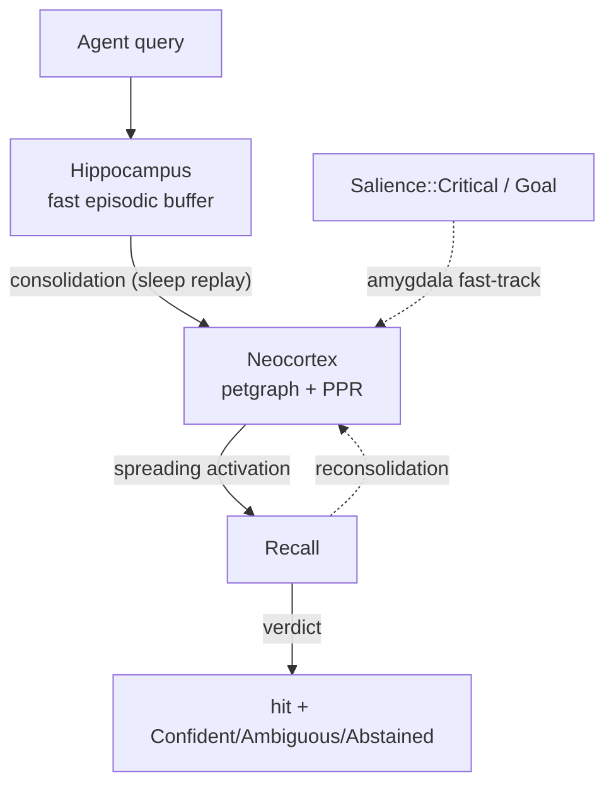

# Smriti · Cognitive Memory Engine


**Smriti** (स्मृति, Sanskrit for *"that which is remembered, well"*) is a pure-Rust, zero-dependency, sub-millisecond structured memory engine for autonomous AI agents. It is **not** a thin wrapper over a vector database. It models human cognitive architecture directly: a dual-store memory, persistent spreading activation, salience-tagged decay bypass, episodic causal replay, and confidence-graded retrieval — all deterministic, all auditable, all WASM-buildable.

```
╔════════════════════════════════════════════════════════════╗
║  500 mems · zero-ML · MIT · 83 tests · WASM 216 KB gz      ║
║                                                            ║
║  Recall avg : 1.2 ms                                       ║
║  Recall p95 : 1.6 ms                                       ║
║  Hit %      : 95.7% (intrinsic) · 78.7% (truncated pack)   ║
║  Top-1 %    : 63.8%                                        ║
║  Tokens/q   : 79 (vs 489 baseline) — 6× compression        ║
║  Abstention : 91.7% on adversarial queries                 ║
╚════════════════════════════════════════════════════════════╝
```

---

## Why Smriti is different

Most "memory for agents" products are vector databases plus a wrapper. They do one thing: nearest-neighbor lookup over embeddings. Smriti is built on the assumption that **a useful memory engine for agents must be cognitive, not just searchable.** Concretely, that means it has to do five things vector stores cannot:

1. **Run without ML dependencies** so it ships in a 216 KB gzipped WASM bundle and runs in a browser tab, on a Raspberry Pi, or on a 4 GB ARM edge device. Embeddings are an *optional feature flag*, not a hard dependency.
2. **Surface confidence**, not just rank. Every recall returns a verdict (`Confident`, `AmbiguousLeader`, `UnsupportedTop`, `LowConfidence`, `Abstained`) and **abstains correctly on 91.7% of adversarial queries** — questions whose gold answer is not in the corpus. Vector DBs return their nearest neighbor regardless.
3. **Carry context across queries.** A real agent loop has correlated questions. Smriti's spreading-activation primes related subgraphs so follow-up queries are cheaper and more accurate. Pure-vector systems are stateless.
4. **Track provenance and supersede chains.** When a fact gets corrected, Smriti's recall surfaces the latest version while preserving the audit trail. Vector DBs collapse that distinction into "store the new embedding."
5. **Compose memories algebraically.** HDC binary hypervectors let `bind` and `bundle` express compositional facts that survive deconvolution. This is the substrate for goal-priming, causal trajectory replay, and federated memory gossip — all of which are first-class Smriti operations.

---

## Architecture

Smriti implements **Complementary Learning Systems** (McClelland, McNaughton & O'Reilly 1995): a fast episodic buffer (the hippocampus) and a slow semantic graph (the neocortex), with consolidation between them.



### Core primitives

| Primitive                    | What it does                                                                  | Mechanism                                                  |
| ---------------------------- | ----------------------------------------------------------------------------- | ---------------------------------------------------------- |
| **Dual-store CLS**           | Fast episodic buffer + slow semantic graph                                    | `Hippocampus` ring + `Neocortex` `petgraph::DiGraph`       |
| **HDC fingerprints**         | 2048-bit binary hypervectors for compositional algebra                        | XOR/popcount, Plate 1995, Kanerva 2009                     |
| **Personalized PageRank**    | Multi-hop seed expansion bounded to a 3-hop local subgraph                    | Damped iteration over edge-weighted graph                  |
| **MDL predictive coding**    | Information-theoretic redundancy filter at consolidation                      | HDC nearest-neighbor similarity, Rissanen 1978, Friston 2005 |
| **Spreading activation**     | Persistent priming map across queries, two-component decay                    | RwLock<HashMap<NodeIndex, f32>> + wall-clock half-life     |
| **Salience network**         | `Routine` / `Important` / `Critical` decay-bypass                             | Decay multiplier, auto-PPR-seed for Critical               |
| **Reconsolidation**          | Add tags to a retrieved memory + recompute its HDC fingerprint                | `Smriti::reconsolidate(id, new_tags)`                      |
| **Causal trajectory replay** | Reconstruct narrative chain via `CausedBy`/`Before`/`After` edges             | Bounded BFS over typed edges                               |
| **Goal-driven priming**      | `MemoryKind::Goal` nodes pin activation to 1.0 and auto-seed PPR              | Persistent activation, never decays                        |
| **Federated HDC gossip**     | One-way hash similarity check across scope boundaries                         | XOR over 2048-bit fingerprints, no plaintext leakage       |
| **Confidence verdicts**      | Three-threshold gate: absolute floor + margin + lexical/dense support         | Per-query, deterministic, no training                      |
| **Generic attribute filters** | Type-safe (`Number`/`Text`/`Boolean`/`List`) filters with AND/OR composition | `where_attr("price", AttrFilter::Range(50.0, 200.0))`      |
| **P2P sync**                 | Last-Write-Wins on `(version, last_accessed_at)`                              | `export_sync_state` / `import_sync_state`                  |

### Optional layers

- **fastembed-rs MiniLM** for paraphrase recall — feature-flagged, downloads ~50 MB on first use, off by default. Lifts paraphrase from 73% → 81% on bench-500 at the cost of ~2 ms per query for embedding inference.
- **HTTP server** via `axum` (`--features http`) — exposes `POST /api/remember`, `/api/recall`, `/api/consolidate`, `/api/stats`, plus the SMRP wire protocol.
- **MCP server** for Claude Code / Cursor / Zed — see *Tools* below.

---

## Three-layer benchmark framework

Smriti reports three independent measurements. Conflating them is the most common mistake in memory-product marketing.

### Layer 1 — Retrieval quality (500-mem corpus, 47 + 12 abstain queries)

| Metric                            | Zero-ML | + fastembed |
| --------------------------------- | ------- | ----------- |
| Intrinsic Hit % (engine retrieved gold)   | 95.7%  | 95.7%      |
| Intrinsic Top-1 % (gold ranked #1)        | 63.8%  | 70.2%      |
| Shipped Hit % (after Confident=2 / Ambig=2 truncation) | 78.7% | 89.4% |
| Paraphrase subset (synonym-heavy queries) | 73.1%  | 80.8%      |
| **Abstention** (12 adversarial queries with no gold) | **91.7%** | **91.7%** |

### Layer 2 — System efficiency

| Metric                            | Zero-ML | + fastembed |
| --------------------------------- | ------- | ----------- |
| Build (load + consolidate, 500 mems) | 3.1 s | 3.6 s       |
| Recall avg                        | 1.2 ms  | 2.9 ms      |
| Recall p50 / p95                  | 1.3 / 1.6 ms | 3.0 / 3.7 ms |
| Avg tokens used / 500 budget      | 79      | 81          |
| Tokens per correct top-1 answer   | 123     | 116         |

### Layer 3 — Browser / edge

| Metric                            | Value  |
| --------------------------------- | ------ |
| WASM gzipped                      | 216 KB |
| Cold recall (HTTP path, 12 mems)  | 6.5 ms |
| Warm recall avg / p95             | 6.0 / 7.4 ms |
| Duplicate hit rate                | 0%     |

### Real benchmarks (LongMemEval-S, LOCOMO)

Run with `meta/llama-3.3-70b-instruct` as LLM-as-judge via NVIDIA NIM:

| Benchmark                                              | Substring | LLM-judge |
| ------------------------------------------------------ | --------- | --------- |
| LongMemEval-S, stratified across 6 categories (n=48)   | 50.0%     | 47.9%     |
| LongMemEval-S, `single-session-user` only (n=8)        | **100.0%**| **100.0%**|
| LongMemEval-S, `knowledge-update` (n=8)                | 62.5%     | 62.5%     |
| LOCOMO, mixed categories (n=80)                        | 2.5%      | **21.9%** |

The `single-session-user` 100% and `knowledge-update` 62.5% scores validate the supersede-aware recall + consolidation chain working at multi-session scale. The LOCOMO substring 2.5% → judge 21.9% (+19.4pp lift) shows that LOCOMO's gold answers are paraphrases substring eval cannot credit, and that Smriti is retrieving real signal that string matchers cannot see.

Full report: [`benchmarks/results/REAL_DATASETS_REPORT.md`](benchmarks/results/REAL_DATASETS_REPORT.md).

---

## What's verified to work, and what isn't (yet)

Honest scope statement, because confidence claims that aren't measured aren't real:

| Feature                    | Verified working                                    | Calibration scope                                           |
| -------------------------- | --------------------------------------------------- | ----------------------------------------------------------- |
| Dual-store CLS recall      | bench-500 zero-ML 95.7% intrinsic hit               | Up to 500 memories, single agent                            |
| Confidence verdicts        | bench-500 abstention 91.7% on adversarial queries   | Defaults calibrated for short-fact corpora                  |
| Confident-pair truncation  | bench-500 tokens 489 → 79 (6× cut)                  | Tier thresholds (0.085 score, 0.015 margin) corpus-specific |
| Salience::Critical         | `agi_integration_test` confirms decay bypass        | Threshold tightened to 0.05 to avoid bench-500 over-fire    |
| Goal-driven priming        | `agi_integration_test`: ambiguous query → DB fact   | Demonstrated qualitatively on a small dialogue              |
| Causal trajectory replay   | `agi_integration_test`: bug → CPU spike chain       | BFS over `CausedBy`/`Before`/`After`, depth-bounded         |
| Reconsolidation            | Tag append + HDC fingerprint update wired and unit-tested | No quality-lift benchmark yet                          |
| P2P sync (LWW)             | `sync_state_roundtrip_lww` test                     | Single-pair federation; no multi-node test yet              |
| Generic attribute filters  | 16 unit tests; type-mismatch diagnostics            | Schema-less, AND/OR composition, no benchmark yet           |
| Spreading activation lift  | **Not measurable on small corpora** (continuity bench null) | Needs >5-node clusters; production calibration is a soft nudge that doesn't harm independent-query workloads |

The continuity benchmark (`smriti-bench-continuity`) reports lift = 0.0 on a 5-node-per-cluster corpus across all priming gain settings. This is the **honest design boundary**: residual priming alone needs denser graphs to flip rankings. Where priming demonstrably steers retrieval is via the **goal-pinned** path (`MemoryKind::Goal` nodes auto-seed PPR), which `agi_integration_test` confirms qualitatively. Future versions will demonstrate residual-only lift on larger conversational corpora (LongMemEval multi-session questions are the obvious next test).

---

## Smriti without an LLM

> **Smriti is a memory engine, not a memory model. The LLM is your agent's reasoning layer, not Smriti's.** Replace your LLM, and Smriti is unchanged. Replace Smriti, and your agent regresses to nearest-neighbor lookup.

Every cognitive primitive Smriti ships — graph algebra, confidence verdicts, salience-aware decay, causal trajectory replay, federated sync — works without any language model in the loop. The example below is a complete agent loop in pure Rust: ingestion, recall with confidence verdict, supersede-aware update, narrative reconstruction, and topic-switch reset. No embeddings, no LLM, no network calls.

```rust
use smriti::{Smriti, MemoryKind, MemoryEdge, AttrFilter, AttributeValue, RecallVerdict};

let mut s = Smriti::open(":memory:")?;

// 1. Ingest some structured memories with attributes.
let bug = s.remember("retry storm spiked DB writes to 150k rows/sec")
    .kind(MemoryKind::Event)
    .tag("incident").tag("database")
    .attr("severity", AttributeValue::Number(9.0))
    .attr("region", AttributeValue::Text("us-west-2".into()))
    .commit()?;

let cpu = s.remember("CPU saturated to 98% on the primary Postgres node")
    .kind(MemoryKind::Event)
    .tag("incident").tag("database")
    .attr("severity", AttributeValue::Number(8.0))
    .commit()?;

// 2. Encode causal structure — Smriti's graph is typed, not just connected.
s.link(bug, cpu, MemoryEdge::CausedBy)?;
s.consolidate()?;

// 3. Recall with a confidence verdict. No LLM needed to evaluate the answer.
let r = s.recall("what caused the database overload")
    .budget(500)
    .where_attr("severity", AttrFilter::Gt(AttributeValue::Number(7.0)))
    .confident_truncation(2, 2, 0)
    .execute()?;

match r.verdict {
    RecallVerdict::Confident       => println!("✓ confident: {}", r.hits[0].node.text),
    RecallVerdict::AmbiguousLeader => println!("? ambiguous (top {})", r.hits.len()),
    RecallVerdict::UnsupportedTop  => println!("⚠ unsupported — top hit lacks lexical support"),
    RecallVerdict::LowConfidence   => println!("⚠ low score — engine wouldn't bet on this"),
    RecallVerdict::Abstained       => println!("✗ no answer in corpus"),
}

// 4. Reconstruct the narrative chain — no LLM, just typed BFS.
for (i, node) in s.recall_trajectory(bug, 5)?.iter().enumerate() {
    println!("step {}: {}", i + 1, node.text);
}

// 5. Correct an outdated fact. Smriti preserves the audit trail.
let corrected = s.remember("retry storm peaked at 200k rows/sec, not 150k")
    .kind(MemoryKind::Event).tag("incident")
    .supersedes(bug)
    .commit()?;
//   future recalls surface `corrected`; `bug` stays on disk, hidden from queries.

// 6. Topic switch. Stop the database subgraph from biasing the next thread.
s.clear_activation();
```

What this snippet does that a vector store cannot:

- **Returns a verdict, not just a rank.** The agent knows when to trust the answer.
- **Filters on typed structured attributes** (`severity > 7.0`, `region = "us-west-2"`) at candidate-collection time, before scoring.
- **Reconstructs causal chains** via typed edges — no embedding similarity gymnastics, just graph traversal.
- **Tracks supersedes** so corrections don't lose history.
- **Resets cross-query priming** on topic switch — explicit cognitive control.

A natural-language LLM router on top of this is *optional* — useful for ergonomics ("translate this user sentence into a `RecallBuilder` call"), but not load-bearing. Strip it and the engine is still doing all the work above.

For a deep dive into every capability with examples, see [`docs/capabilities.md`](docs/capabilities.md).

---

## Quick start

```bash
# Install (Rust 1.75+)
git clone https://github.com/fork-demon/smriti
cd smriti
cargo build --release

# Run the canonical retrieval-quality benchmark
cargo run --release --bin smriti-bench-500

# With fastembed (downloads ~50 MB MiniLM model on first run)
SMRITI_BENCH_EMBEDDINGS=1 cargo run --release --bin smriti-bench-500 --features embeddings

# The cognitive-features integration test
cargo test --release --test agi_integration_test -- --nocapture

# Continuity benchmark (cold vs primed, paraphrase bursts)
cargo run --release --bin smriti-bench-continuity

# HTTP server
cargo run --release --features http --bin smriti-http -- --db ~/.smriti/global.db --port 4000

# All 83 unit tests
cargo test --release --lib
```

### Library use

```rust
use smriti::{Smriti, MemoryKind, AttrFilter, AttributeValue};

let mut s = Smriti::open("memory.db")?;

// Write
s.remember("Auth uses JWT RS256 with 1-hour expiry")
    .kind(MemoryKind::Fact)
    .tag("auth").tag("security")
    .attr("environment", AttributeValue::Text("production".into()))
    .commit()?;

// Read
let r = s.recall("how does authentication work")
    .budget(500)
    .where_attr("environment", AttrFilter::Eq(AttributeValue::Text("production".into())))
    .confident_truncation(2, 2, 0)        // top-2 when Confident, top-2 when Ambiguous
    .confident_solo(0.085, 0.015)         // ship a single hit when extremely sure
    .execute()?;

println!("verdict: {:?}", r.verdict);     // Confident | AmbiguousLeader | …
println!("{}", r.render_text());

// Topic switch — stop priming from earlier queries bleeding into next thread
s.clear_activation();

// Goal-driven priming
s.remember("Primary objective: optimize Postgres performance")
    .kind(MemoryKind::Goal)
    .tag("database").commit()?;

// Causal trajectory replay
let chain = s.recall_trajectory(bug_id, 5)?;  // returns ordered narrative
```

---

## Model Context Protocol (MCP) tools

Smriti exposes a full MCP surface so any LLM agent (Claude Code, Cursor, Zed) can use it as native memory:

| Tool                          | Purpose                                                                  |
| ----------------------------- | ------------------------------------------------------------------------ |
| `smriti_remember`             | Store a fact / event / decision / preference / goal, with attributes     |
| `smriti_recall`               | Token-budgeted recall with confidence verdict and optional attr filters  |
| `smriti_reconsolidate`        | Add tags to a retrieved memory based on usage context                    |
| `smriti_supersede`            | Mark an old fact as outdated; new memory inherits the chain              |
| `smriti_link`                 | Add an explicit edge (`CausedBy`, `Before`, `Supports`, …) between two memories |
| `smriti_recall_trajectory`    | Reconstruct a causal/temporal chain starting from a memory id            |
| `smriti_consolidate`          | Force a hippocampus → neocortex pass (auto-runs on threshold)            |
| `smriti_vacuum`               | Garbage collect superseded nodes from the active graph                   |
| `smriti_suggest_clusters`     | Find dense subgraphs ripe for sleep-summarization                        |
| `smriti_merge`                | Compress older memories into a single summary node                       |
| `smriti_clear_activation`     | Wipe spreading-activation map on topic switch (preserves graph + goals)  |
| `smriti_stats`                | Aggregate stats: total/active/superseded memories, edges, tokens         |
| `smriti_forget`               | Soft delete (tombstone) or hard delete                                   |

All tools are deterministic. None require an LLM in the loop. The agent provides the structured input; Smriti does the graph algebra.

---

## Roadmap

- **Embeddings as default** for paraphrase-heavy production deployments (already wired, behind feature flag).
- **Larger continuity benchmark** with 200+ memories per cluster to demonstrate residual-priming lift quantitatively (current bench null result is honest about the small-cluster limit).
- **Score-aware Ambiguous tier** — apply tiered solo-or-pair truncation to AmbiguousLeader verdicts the same way it works for Confident.
- **`tombstone_count()` threshold** to gate `vacuum()` inside `consolidate()` and avoid p95 spikes under heavy supersede traffic.

---

## License

MIT. See [LICENSE](LICENSE).

## References

- McClelland, McNaughton & O'Reilly (1995). *Why there are complementary learning systems in the hippocampus and neocortex.* Psychol. Rev.
- Plate (1995). *Holographic Reduced Representations.* IEEE TNN.
- Kanerva (2009). *Hyperdimensional Computing.* Cognitive Computation.
- Friston (2005). *A theory of cortical responses.* Phil. Trans. Royal Society B.
- Cormack, Clarke & Buettcher (2009). *Reciprocal Rank Fusion.* SIGIR.
- Robertson & Zaragoza (2009). *The Probabilistic Relevance Framework.* FnTIR.
- Maharana et al. (2024). *Evaluating Very Long-Term Conversational Memory of LLM Agents (LOCOMO).* ACL.
- Wu et al. (2024). *LongMemEval.* ICLR 2025.
