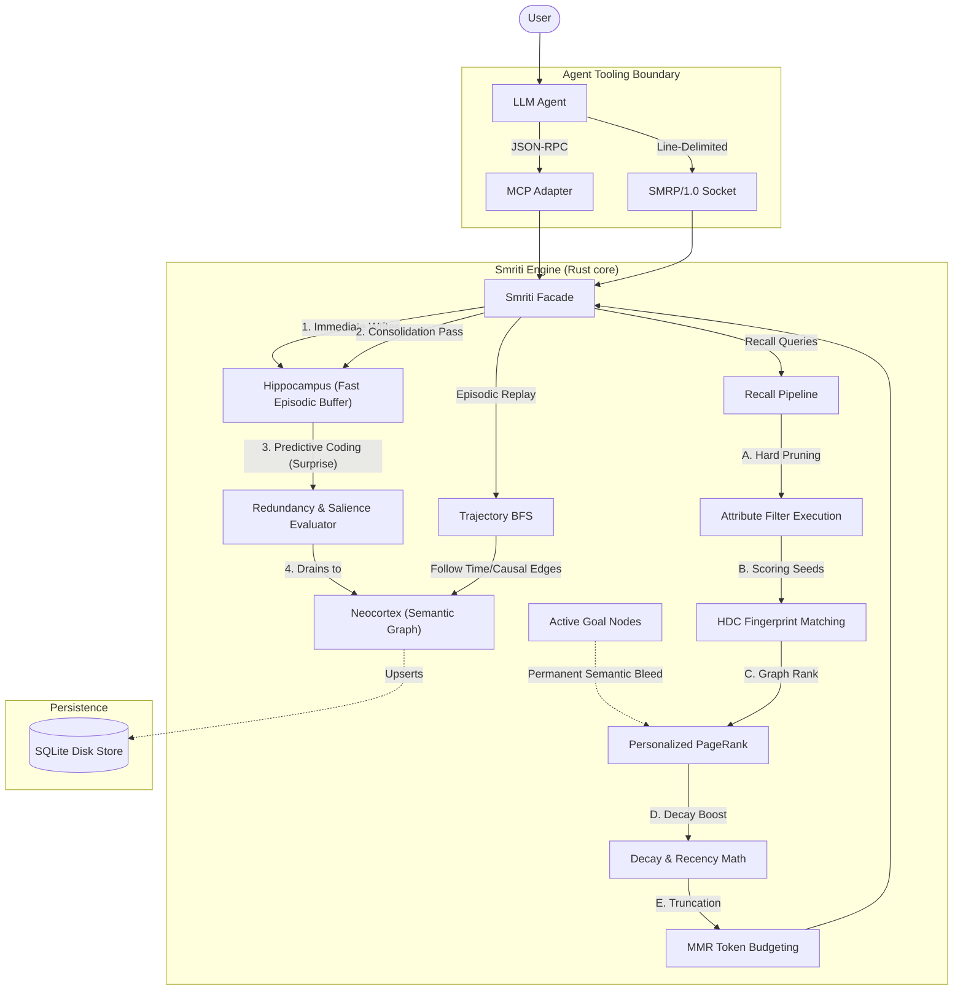

# Smriti Architecture Flow

Smriti is explicitly **Protocol-First**. It separates **Generative Intelligence** (handled by external LLM agents) from **Cognitive State** (handled by the Smriti engine). Agents communicate with Smriti over the wire via the **SMRP/1.0** protocol (Smriti Memory Request Protocol) or via the **Model Context Protocol (MCP)** adapter. The engine itself is an embedded, WASM-compatible Rust crate that behaves purely deterministically. 

Below is the end-to-end data flow when an Agent interfaces with Smriti.

## High-Level Architecture Diagram

## Layer-by-Layer Breakdown

### 1. The Protocol Layer (SMRP/1.0 & MCP)
**What it does:** Smriti does not embed language models. It is a standalone service. Agents talk to it over the wire using either **SMRP/1.0** (a highly debuggable, versioned, line-delimited socket protocol native to Smriti) or the widely supported **Model Context Protocol (MCP)**.
**Example:**
* **User says:** "Hey, ignore what I said last Tuesday, I actually prefer Python for this project."
* **Agent action:** The LLM agent parses this intent. It translates "last Tuesday" to a timestamp and issues two tool calls over SMRP or MCP:
  1. `smriti_recall` with a deterministic time filter to find the old preference.
  2. `smriti_supersede` to replace the old ID with the new Python preference.

### 2. Hippocampus (Episodic Buffer)
**What it does:** When new memories arrive, they are instantly dropped into the Hippocampus—a small, highly transient, in-memory queue.
**Why it matters:** Graph insertions and HDC recalculations are slightly expensive. The Hippocampus acts as a fast write-buffer. If the agent immediately asks a follow-up question, the Hippocampus is searched via fast substring matching, ensuring 0-latency recent context.

### 3. Consolidation & Predictive Coding (The "Sleep" Bridge)
**What it does:** Once the Hippocampus reaches capacity, Smriti triggers an automatic "Consolidation Pass" moving nodes into the Neocortex.
**Why it matters:** During consolidation, Smriti mathematically drops duplicate memories, extracts domain keywords, generates high-dimensional bit vectors (HDC Fingerprints), and creates native `RelatesTo` graph edges. 
**Surprise Mechanics:** It also runs a Predictive Coding check. If a new memory's HDC fingerprint has extremely low similarity to the existing graph, the engine classifies it as an "Anomaly," automatically bumping its `Salience` to `Critical` and permanently boosting its importance to bypass standard decay.

### 4. Neocortex (Semantic Memory Graph)
**What it does:** The Neocortex is the primary long-term memory store. It is modeled as a massive Directed Graph using `petgraph`.
**Retrieval Execution (The Pipeline):**
When a recall query hits the Neocortex, it runs a rigorous multi-step pipeline:
1. **Attribute Filtering:** Deterministically slices out nodes that don't match strict rules (e.g., `role != manager`).
2. **HDC Matching:** Converts the query to a 2048-bit hypervector and runs fast XOR comparisons against all candidate nodes to find highly similar "seed" memories.
3. **Personalized PageRank (PPR) & Goal Priming:** This is the magic. From those seeds, it traverses the graph structure up to 3 hops out. Memories structurally connected to the seeds gain high rank. **Crucially**, any active `MemoryKind::Goal` nodes act as permanent implicit seeds, constantly bleeding "Semantic Priming" into the graph to keep the agent focused on its objective regardless of the specific query keywords.
4. **Decay:** Adjusts scores based on the node's biological age, half-life, and access count.

### 5. Episodic Replay (Causal Trajectories)
**What it does:** A separate retrieval pathway parallel to the Recall Pipeline. Agents can explicitly reconstruct narrative chains.
**Why it matters:** Instead of PageRank (which is associative), Trajectory Recall runs a strict Breadth-First Search (BFS) following only `CausedBy`, `Before`, `After`, and `DerivedFrom` edges. This allows agents to recall step-by-step histories of how a problem unfolded.

### 6. Persistence (SQLite / In-Memory)
**What it does:** The bottom layer handles strict data durability. It saves node schemas and edge relations.
**Why it matters:** Because all the heavy graph logic happens in RAM inside the Neocortex, the database layer is extremely dumb and fast. On Native targets, it's a single file SQLite database. On WASM targets (like running in the browser), it gracefully degrades to a pure in-memory struct.
